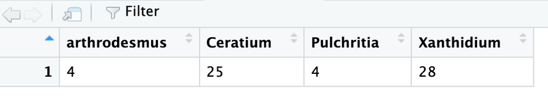

```{r setup, include=FALSE}
knitr::opts_chunk$set(echo = TRUE)
```

#### **Introduction [5 points].**

Horsetooth Reservoir is a six and one quarter mile long reservoir located just West of Fort Collins, CO. It was completed in 1949 and made its first releases to the Poudre River in July of 1951. Horsetooth has a capacity of 156,735 acre-feet, 25 miles of shoreline, and a maximim depth of 188 feet (Horsetooth Reservoir \| Northern Water). It was created as part of the Colorado-Big Thompson project, which aimed to supply the east slope with water for drinking, irrigation, and hydropower from the west slope. It is jointly managed by the Bureau of Reclamation, the Northern Colorado Water Conservancy District, and Larimer County (Horsetooth Reservoir \| Larimer County).

#### **Methods [5 points].**

**For full credit you must include:**

**A description of the sampling effort including an overview of which samples were taken and why.** **A map of Horsetooth Reservoir with our sampling location clearly identified. Image should include a caption. Map can either be inserted into your R Markdown as an image or created in R using a code block.**

#### Results (figures and calculations) [27 points]

**A presentation of the physical, chemical, and biological properties of the water column where we sampled.**

```{r}
library(tidyverse)
library(ggthemes)
library(dplyr)
library(stringr)
library(gridExtra)
```

```{r}


#Read in ProfileData
G01<-read_csv("/Users/wamclean/github/LimnologyLabs/Lab4/Group01_09062024_profiledata.csv") 
G03<-read_csv("/Users/wamclean/github/LimnologyLabs/Lab4/Group03_09062024_profiledata.csv") 

combined_data<- rbind(G01,G03)

```

```{r}
combined_data <- combined_data %>%
  select(where(~ any(!is.na(.)))) #remove empty columns from the dataset, in this case "sal" and "chla_ugL"

#use the select tool to chose which parameters you want in your new file
#use drop_na() last to remove any empty rows

temp<- combined_data %>% 
  select(group, z_m, temp_c) %>% 
  drop_na()

pH<- combined_data %>% 
  select(group, z_m, ph)%>% 
  drop_na()

conductivity<- combined_data %>% 
  select(group, z_m, cond)%>% 
  drop_na() 

do_percent<- combined_data %>% 
  select(group, z_m, do_percent) %>% 
  drop_na()

do_mgL<- combined_data %>% 
  select(group, z_m, do_mgL) %>% 
  drop_na()

```

a.  Each figure should have meaningful and axis labels (changed from the default label if appropriate, and with appropriate units), a legend, and a title.
b.  Profiles should have the y axis inverted.
c.  All figures should be indexed (i.e., Figure 1, Figure 2 etc.) and include a caption. In the remaining text of the report, when you want to refer to your figure to make a point, please use your figure numbers (like in a scientific journal article)
d.  For full credit you must include the following data. For items 1-3, use the data from whichever depth profile you uploaded to Canvas under the "Horsetooth Sampling Data Entry” assignment. For items 5-7, include class means and your group’s means, incorporated as you see fit into an appropriate figure.

<!-- -->

##### An oxygen profile, containing both the DO (percent) and DO (mg/L) series

```{r}
do_percent_prof <- ggplot() +  
  geom_point(data = do_percent, mapping = aes(x = do_percent,y = z_m, color = group, shape = group), size = 3, show.legend = TRUE)+
  theme_bw() +
  labs( x='DO (%)',
        y= 'Depth (m)',
        color = "",
        shape = "")+
  scale_y_reverse(expand = c(0.015,0))+
  scale_color_manual(values = c("Group_1" = "blue3", "Group_3" = "green3"),
                     labels = c("Group_1" = "Group 6", "Group_3" = "Group 3")) +
  scale_shape_manual(values = c("Group_1" = 16, "Group_3" = 17),
                     labels = c("Group_1" = "Group 6", "Group_3" = "Group 3")) +
  theme(text = element_text(size = 10))

do_mgL_prof <- ggplot() +  
  geom_point(data = do_mgL, mapping = aes(x = do_mgL,y = z_m, color = group, shape = group), size = 3, show.legend = TRUE)+
  theme_bw() +
  labs( x='DO (mg/L)',
        y= 'Depth (m)',
        color = "",
        shape = "")+
  scale_y_reverse(expand = c(0.015,0))+
  scale_color_manual(values = c("Group_1" = "blue3", "Group_3" = "green3"),
                     labels = c("Group_1" = "Group 6", "Group_3" = "Group 3")) +
  scale_shape_manual(values = c("Group_1" = 16, "Group_3" = 17),
                     labels = c("Group_1" = "Group 6", "Group_3" = "Group 3")) +
  scale_x_continuous(breaks = seq(floor(min(do_mgL$do_mgL)), ceiling(max(do_mgL$do_mgL)), by = 1.5)) + 
  theme(text = element_text(size = 10))

grid.arrange(do_percent_prof, do_mgL_prof, top = "Dissolved Oxygen in Horsetooth Reservoir")

```

###### Figure 1: Dissolved Oxygen profiles in Horsetooth Reservoir, shown as a percentage and concentration in milligrams per liter.

##### A temperature profile

```{r}
temp_prof <- ggplot(data = temp, mapping = aes(x=temp_c, y=z_m, color=group, shape= group)) +  
  geom_point(size=3, show.legend = TRUE)+
  theme_bw() +
  labs( x='Temp (C)',
        y= 'Depth (m)',
        color = "",
        shape = "",
        title = "Horsetooth Reservoir Temperature Profile")+
  scale_y_reverse(expand = c(0.015,0))+
  scale_color_manual(values = c("Group_1" = "blue3", "Group_3" = "green3"),
                     labels = c("Group_1" = "Group 6", "Group_3" = "Group 3")) +
  scale_shape_manual(values = c("Group_1" = 16, "Group_3" = 17),
                     labels = c("Group_1" = "Group 6", "Group_3" = "Group 3")) +
  scale_x_continuous(breaks = seq(floor(min(temp$temp_c)), ceiling(max(temp$temp_c)), by = 1.5)) + 
  scale_x_continuous(breaks = seq(floor(min(temp$temp_c)), ceiling(max(temp$temp_c)), by = 1.0))+
  theme(text = element_text(size = 10)) 

temp_prof
```

###### Figure 2: Temperature profile of Horsetooth Reservoir showing data collected by two groups.

##### A pH profile

```{r}
pH_prof <- ggplot(pH,aes(x=ph,y=z_m, color=group, shape= group)) +  
  geom_point(size=3, show.legend = TRUE)+
  theme_bw() +
  labs( x='pH',
        y= 'Depth (m)',
        color = "",
        shape = "",
        title = "Horsetooth Reservoir pH Profile")+
  scale_y_reverse(expand = c(0.015,0))+
  scale_color_manual(values = c("Group_1" = "blue3", "Group_3" = "green3"),
                     labels = c("Group_1" = "Group 6", "Group_3" = "Group 3")) +
  scale_shape_manual(values = c("Group_1" = 16, "Group_3" = 17),
                     labels = c("Group_1" = "Group 6", "Group_3" = "Group 3"))+
  scale_x_continuous(breaks = seq(floor(min(pH$ph)), ceiling(max(pH$ph)), by = .1))+
  theme(text = element_text(size = 10)) 

pH_prof
```

###### Figure 3: pH profile of Horsetooth Reservoir showing data collected by two groups.

##### The standard curve for TN from that prior assignment (but created in R). Add your group’s samples’ TN values on the curve in a conspicuous manner (e.g. different color or shape)

```{r}
mgL <- read_csv("/Users/wamclean/github/LimnologyLabs/FinalProject/ESS474Fall2024stdcurvedata.csv")

mgL <- mgL %>% 
  mutate(color = "1")

SampleData <- read_csv("/Users/wamclean/github/LimnologyLabs/Lab5/stdcurvedata.csv")
```

###### What is the equation of the standard curve?

```{r}

model_data <- mgL %>% 
  filter(Area != 249.1000)

AreaModel <- lm(mg_L_TN ~ Area, model_data)
summary(AreaModel)
```

y = 0.03927x - 0.0005810

###### What is the R2 of your curve?

R-Squared = 0.9999

**Did you remove any of the points from your curve? Why or why not?**

Yes, I removed the point where the Area value was 249.1000 because it appeared to be an outlier. Doing so resulted in a change in my R-squared value from 0.9998 to 0.9999

```{r}
x <- SampleData$Area

SampleData <- SampleData %>% 
  mutate(N = 0.03927*x - 0.0005810) %>% 
  filter(Excluded != 1)
  
GroupTotals <- SampleData %>% 
  separate(Sample_Name, into = c("Group_Number", "Sample_Number"), sep = "-", extra = "merge", fill = "right")

Group6_TN <- GroupTotals %>% 
  filter(Group_Number == "G6")
```

```{r}
#Plot Standard Curve, filtering out Area = 249.1000 as doing to brings the R2 from 0.9998 to 0.9999

TN <- ggplot(data = filter(mgL, Area != 249.1000), mapping = aes(x = mg_L_TN, y = Area))+
  theme_bw()+
  geom_point(aes(color = color))+
  geom_smooth(method="lm", size = .5)+
  geom_point(data = Group6_TN, mapping = aes(x = N, y = Area, color = Group_Number), alpha = .5)+
  labs(
    x = "Total Nitrogen (ug/L)",
    y = "Area",
    title = "Total Nitrogen vs. Area Standard Curve and Group 6 TN Data",
    color = "",
  )+
  scale_color_manual(values = c("1" = "black", "G6" = "red"),
                     labels = c("1" = "Standard Curve Data", "G6" = "Group 6 Data"))+
  theme(legend.position = "bottom")
  


TN
```

###### Figure 4: Standard Curve showing total nitrogen and calculated area using the equation y = 0.03927x - 0.0005810. In red is the data collected by our group.

##### A comparison of total nitrogen between the epilimnion and hypolimnion depths

```{r}
#Filter to just epilimnion and hypolimnion samples, leaving out samples that do not designate location in the water column. Adding a SampleLocation Column for ease of plotting
Epi <- GroupTotals %>% 
  filter(str_detect(Sample_Number, "E-")) %>% 
  mutate(SampleLocation = "Epi")

Hypo <- GroupTotals %>% 
  filter(str_detect(Sample_Number, "H-")) %>% 
  mutate(SampleLocation = "Hypo")

#Bind them back together to compare
N_Comparison <- bind_rows(Epi, Hypo)

#Boxplot to show distribution of data
N_Box <- ggplot()+
  theme_bw()+
  geom_boxplot(data = N_Comparison, mapping = aes(x = SampleLocation, y = N, color = SampleLocation))+
  labs(x = "Sample Location",
       y = "N (mg/L)",
       color = "",
       title = "Distribution of All Nitrogen Measurements - Horsetooth Reservoir")+
  theme(legend.position = "none")

N_Box
```

###### Figure 5: Boxplot showing the distribution of Nitrogen measurements in mg/L

```{r}

N_Totals <- N_Comparison %>% 
  group_by(SampleLocation) %>% 
  summarize(meanN = mean(N),
            totalN = sum(N),
            min = min(N),
            max = max(N))

print(N_Totals)

N_Total_Plot <- ggplot()+
  theme_bw()+
  geom_col(data = N_Totals, mapping = aes(x = SampleLocation, y = totalN, fill = SampleLocation))+
  labs(x = "Sample Location",
       y = "Total N (mg/L)",
       fill = "",
       title = "Total Observed Nitrogen - Horsetooth Reservoir")

N_Total_Plot

```

###### Figure 6: Comparison of total observed Nitrogen

##### A figure illustrating the distribution of epilimnion chlorophyll a values taken by everyone, and the mean value.

```{r}
ChlA <- read_csv("/Users/wamclean/github/LimnologyLabs/FinalProject/Horsetooth_Chla_data_2024.csv") %>% 
  mutate(SampleLocation = "Epilimnion")

ChlA_Plot <- ggplot()+
  theme_bw()+
  geom_boxplot(data = ChlA, mapping = aes(x = SampleLocation, y = Chla_ugL))+
  labs(x = "Sample Location",
       y = "Chlorophyll A (ug/L)",
       title = "Distribution of Epilimnion Chlorophyll A Measurements - Horsetooth Reservoir")

ChlA_Plot

ChlA_Mean <- mean(ChlA$Chla_ugL)
ChlA_Mean

```

###### Figure 7: Boxplot showing the distribution of Chlorophyll A as collected by the class

##### A comparison of dissolved organic carbon values between the epilimnion and hypolimnion depths

```{r}
#Read in DOC
DOC <- read_csv("/Users/wamclean/github/LimnologyLabs/FinalProject/ESS474_HorsetoothReservoir_DOC_2024.csv")


DOC <- DOC %>% 
  separate(Sample_Name, into = c("Group_Number", "Sample_Number"), sep = "-", extra = "merge", fill = "right")

DOC <- DOC %>% 
  filter(str_detect(Sample_Number, "-")) %>% 
  mutate(SampleLocation = if_else(str_detect(Sample_Number, "E-"), "Epi", "Hypo"))

DOC_Dil <- DOC %>% 
  filter(str_detect(Sample_Number, "Dil"))

diluted <- ggplot()+
  theme_bw()+
  geom_boxplot(data = DOC_Dil, mapping = aes(x = SampleLocation, y = Dilution_Result_DissolvedOrganicCarbon), outliers = FALSE)+
  labs(title = "Diluted Samples",
       x = "",
       y = "")

undiluted <- ggplot()+
  theme_bw()+
  geom_boxplot(data = DOC, mapping = aes(x = SampleLocation, y = Result_DissolvedOrganicCarbon))+
  labs(title = "All Samples",
       x = "",
       y = "DOC (mg/L)")

DOC_plot <- grid.arrange(undiluted, diluted, ncol = 2, top = "Distribution of Dissolved Organic Carbon Measurements in Horsetooth Reservoir", bottom = "Sample Location")

DOC_plot

```

###### Figure 8: Boxplots showing the distribution of Dissolved Organic Carbon measurements in Horesetooth Reservoir. On the left are data from All samples, on the right are data from Diluted Samples. The Diluted Samples plot is omitting an Eplimnion outlier of 6.730 mg/L

##### An estimate of your group’s phytoplankton diversity (no figure required) #Shannon Index Value

```{r}
Shannon <- 1.080317
Simpson <- 0.6127385

Shannon
Simpson
```

##### A figure illustrating the distribution of Secchi depths taken by everyone, and the mean value.

```{r}
Secchi <- read_csv("/Users/wamclean/github/LimnologyLabs/FinalProject/HorsetoothSampling_SecchiDepth_2024.csv")

#Filtering out group 10 as their notation is unclear
Secchi <- Secchi %>% 
  filter(group_number != "Group 10") %>% 
  mutate(depth_m = as.numeric(depth_m))

SecchiMean <- Secchi %>% 
  group_by(group_number) %>% 
  summarize(MeanDepth = mean(depth_m)) %>% 
  ungroup()


Group_secchi_plot <- ggplot()+
  theme_bw()+
  geom_col(data = SecchiMean, mapping = aes(x = group_number, y = MeanDepth, fill = group_number))+
  scale_y_reverse(breaks = seq(floor(min(SecchiMean$MeanDepth)), ceiling(max(SecchiMean$MeanDepth)), by = .2)) + 
  labs(x = "Group Number",
       y = "Average Secchi Depth (m)",
       fill = "",
       title = "Average Secchi Depth in Horsetooth Reservoir by Group")

Group_secchi_plot

```

###### Figure 9: Mean Secchi Depth by group, , observations from Group 10 have been omitted as their notation was deemed unreliable

```{r}
indi_secchi_plot <- ggplot()+
  theme_bw()+
  geom_col(data = Secchi, mapping = aes(x = group_number, y = depth_m, fill = Sample_taker), position = "dodge")+
  scale_y_reverse()+
  scale_y_reverse(breaks = seq(floor(min(Secchi$depth_m)), ceiling(max(Secchi$depth_m)), by = .2)) + 
  labs(x = "Group Number/Individual Observer",
       y = "Observed Secchi Depth (m)",
       fill = "",
       title = "Secchi Depth in Horsetooth Reservoir by Individual Observer")
indi_secchi_plot

```

###### Figure 10: Secchi Depth by observer, observations from Group 10 have been omitted as their notation was deemed unreliable

e.  In some cases, not every group took samples for each water quality property, or they took them with the incorrect procedure, or their data is not realistic. Thus, before calculating class means, you should filter out missing data and data from groups who you think is not reliable (include an explanation of this filtering out in the Results (interpretation) section below). If you think your own group’s data is unreliable, still create a figure with the filtered class data and your group’s data if it exists, but also include a note in the Results (interpretation) section below explaining the circumstances; also, rely on the filtered pooled class data values to answer any subsequent questions.

#### Results (interpretation) [18 points]. For full credit please:

Describe each of the figures you created. Comment on any trends or contrasts that are apparent within each figure.

Figure 1:

These Dissolved Oxygen Profiles show nearly identical trends, concentration of dissovled oxygen is high at the surface and gradually drops. Between 10m and 15m concentration drops significantly and continues to do so over short depth intervals, reaching zero somewhere between 20 and 25m depth.

Figure 2:

The temperature profiles show the division between the Epilimnion, Metalimnion, and Hypolimnion with some clarity. Group 1's data shows that temperature remains relatively uniform, right above or below 21 degrees C until about 9m depth, it then quickly falls to \~16.5 degrees C and between 20 and 22.5m depth falls sharply to below 13.5 degrees C. Group 3's data is less consistent but shows a similar trend, the variation may be due to unreliable depth readings when lowering the sond, as the boats we were on were not secured at two points to prevent drifting which can affect depth readings.

Figure 3:

This pH profile shows an interesting trend. Beginning with Group 6's data, we can see pH at the surface is between 7.3 and 7.4, and it gradually rises to \~7.55 at about 7.5m depth, before falling to \~7.3 just below 15m depth. Below 15m pH readings vary significantly at each measurement interval.

Group 3's data shows more extreme variance in readings, we attribute this to movement of the boat altering measurement depths unpredictably and therefor altering the accuracy of readings. While the data from this group is less consistent, it loosely follows the same pattern as Group 6's data.

Figure 4:

This is the standard curve of Total Nitrogen (ug/L) vs. Area with our group's data superimposed over it in red. Clearly our data fits the standard curve.

Figure 5:

This is a comparison of the data distribution of total nitrogen between the epilimnion and hypolimnion depths. They are quite similar, with epilimnion TN varying between .17 and .46 mg/L and hypolimnion between .13 and .49 mg/L. These higher values are considered to be outliers, and the interquartile range for both strata is between .2 and .3 mg/L. This shows a relatively uniform distribution on Nitrogen in the water column. Figure 6 is another helpful visualization of this.

```{r}
print(N_Totals)
```

Figure 6:

This is a comparison of total nitrogen in the epilimnion and hypolimnion from all group samples. The hypolimnion has been found to have sligntly more N than the Epilimnion in Horsetooth Reservoir.

Figure 7:

This boxplot shows the range of values of Chlorophyll A in the epilimnion as collected by all groups, as well as the replicate samples from Group 4. Chlorophyll A measurements vary between .51 and .001 ug/L, with 50% of the data falling between \~.1 and \~.3 ug/L.

Figure 8:

This is a comparison of dissolved organic carbon at epilimnion and hypolimnion depths. The plot on the left represents values from all samples before dilution and shows that the epilimnion has a much wider range of concentration of DOC, with 50% of measurements falling between \~1.5 and \~3.4. The hypolimnion samples show much less variance, with the bulk of the data hovering around 1.5 and 2.1 mg/Lm, with some notable outliers closer to 3.5 mg/L.

The plot on the right shows DOC values after the samples had been diluted, a value of 6.73 mg/L has been omitted from the Epilimnion Samples as it dramatically skewed the plot. These diluted samples show a similar pattern as the other plot, with DOC in the epilimnion being more variable than in the hypolimnion.

Figure 9:

This plot shows mean secchi depth by group, it shows that most groups observed an average secchi depth of about 2.5 to 2.6m depth, while Group 2 observed secchi depth at \~2.3m and Group 3 observed it at \~2.8m. The variance in individual observations is better visualized in Figure 10.

Figure 10:

This plot shows secchi depth observations by individual and accounts for some of the variability in the averaged values of Figure 9. It demonstrates how individual observers in the same location and time may have significant variance in readings. These can be attributed to differences in eyesight, cloud cover, or simple human error. While Groups 2 and 3 remain outliers, the other groups can be seen to be relatively uniform.

Comment on the phytoplankton diversity value you calculated.

Calculations done with provided R script and data shown below, Pulchritia used as stand in for Rotifer species as online review leads us to believe this is the correct species, but the LandCare database did not present it as an option:



**What was your Shannon index value? Is this considered high or low?** 

1.080317

Shannon index values are typically between 1.5 and 3.4. Ours was calculated to be 1.08, this is low and represents a low density of phytoplankton in our samples.

**What was your Simpson index value? Is this considered high or low?** 

0.6127385

The upper limit of the Simpson index is 1, so our value of .61 is not particularly high.

Comparison with other groups could grant insight as to whether our observations are the norm or the enigma. These low values might be attributable to a rushed sampling process, as our group was the last to sample for phytoplankton and the boats began moving as we began sampling, resulting in a diagonal drag through the water column.

#### Discussion [32 points].

**Please answer the following questions in paragraph form and use in-text citations as necessary. For full credit, answer the following questions.**

Were there differences in dissolved organic carbon between depths? Why or why not? **[5 points]**

Were there differences in total nitrogen between depths? Why? **[5 points]**

How does Horsetooth compare to other reservoirs, in terms of each of the water quality parameters we measured? (this will require a citation or citations) **[10 points]**

Building off of c., what limnological characteristics would explain similarities? Differences? **[7 points]**

What study limitations and/or possible errors limit the insights you’ve gained about Horsetooth Reservoir and how so? How would you address these issues in a future Horsetooth Reservoir sampling campaign? **[5 points]**

#### Conclusion [8 points].

**In 2 paragraphs, summarize what you learned about Horsetooth Reservoir. Focus on answering this question: “Based on our class’s collective data, what is the overall health and trophic state of Horsetooth Reservoir, and how do you arrive at this conclusion?”**

#### References [4 points].

Can be any citation style as long as the style is consistent. Please only use peer reviewed literature, and so-called "[gray literature](information%20produced%20outside%20of%20traditional%20publishing%20and%20distribution%20channels,%20and%20can%20include%20reports,%20policy%20literature,%20working%20papers,%20newsletters,%20government%20documents,%20speeches,%20white%20papers,%20urban%20plans,%20and%20so%20on)" (“research and materials produced by organizations outside of the traditional publishing and distribution channels. It can include reports, working papers, government documents, white papers, and evaluations”). Overall total of 5-7 references would be reasonable.

*Horsetooth Reservoir \| Larimer County*. (2024, July 26). <https://www.larimer.gov/naturalresources/parks/horsetooth-reservoir>

*Horsetooth Reservoir \| Northern Water*. (n.d.). Retrieved November 5, 2024, from <https://www.northernwater.org/what-we-do/deliver-water/reservoirs-and-lakes/horsetooth-reservoir>

#### Contribution Roles [1 point]:

Using [this website](https://authorservices.wiley.com/author-resources/Journal-Authors/open-access/credit.html) as a guideline, please describe the contributions of each group member to the final product. Each group member should contribute an equal amount of time and effort. If during the report writing process this is not happening, please reach out to the instructor(s) with your concerns.

```{r}
indi_secchi_plot
Group_secchi_plot
DOC_plot
ChlA_Plot
temp_prof
pH_prof

N_Total_Plot
N_Box
TN


```

